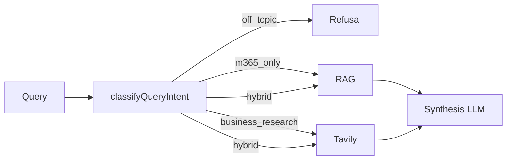

# Business research search — design

## Purpose

Starbot answers **AppXcess work questions** from two evidence sources:

1. **Internal (M365)** — Outlook, SharePoint, OneDrive, workspace knowledge (Pinecone + live Graph).
2. **External (business web)** — Tavily search for industry benchmarks, vendor/company research, and pricing references.

Personal trivia (weather, sports, entertainment) remains **blocked**. Answers are synthesized only from retrieved context blocks, not from model “world knowledge.”

## Intent taxonomy

| Intent | Routing | Examples |
|--------|---------|----------|
| `off_topic` | Fixed refusal | “weather in Chennai”, “cricket score” |
| `m365_only` | RAG only (context-only prompt) | “Summarize my emails”, “1_MSA_Contract.txt” |
| `business_research` | Tavily + synthesis prompt | “industry average restoration pricing per sq ft” |
| `hybrid` | RAG + Tavily in parallel, hybrid synthesis | “Compare our SharePoint MSA with market rates” |

Classification lives in [`apps/api/src/query/query-intent.util.ts`](../apps/api/src/query/query-intent.util.ts).

### Business research patterns (regex)

- Benchmarks: `industry average`, `benchmark`, `market rate`, `typical cost`, `market size`
- Vendors: `vendor`, `supplier`, `company profile`, `research company`, `competitor`
- Pricing: `pricing`, `price list`, `quote`, `RFP`, `cost per`, `rate card`

### M365 signals

Existing mail/document recency helpers, M365 keywords (`outlook`, `sharepoint`, `email`, …), and `APPXCESS_TOPIC_ALIASES`.

### Hybrid rule

Both `isBusinessResearchQuery` and `isM365Query` are true → `hybrid`.

**Important:** Mentioning **AppXcess** alone routes to M365 only. Phrases like **market trend**, **other startups**, or **compare … with** trigger business research. Example: *"Compare the AppXcess market trend with other startups in India"* → **hybrid** (internal + Tavily).

## Request flow

```
User query (Chat or POST /search/unified)
    → QueryOrchestrationService.query()
    → classifyQueryIntent()
    → off_topic → refusal (emptyReason: out_of_scope)
    → m365_only → RagService.query({ bypassTopicGuard: true })
    → business_research → TavilyResearchService → LLM synthesis
    → hybrid → Promise.all([RAG, Tavily]) → hybrid LLM synthesis
```



## Citations

| Label | Meaning |
|-------|---------|
| `[1]`, `[2]` | Internal chunks (mail, SharePoint, OneDrive) |
| `[EXT-1]`, `[EXT-2]` | Tavily web results |

`Citation.source` may be `external` for web hits. UI shows internal and external sections.

## Environment

| Variable | Default | Role |
|----------|---------|------|
| `ENABLE_BUSINESS_RESEARCH` | `true` | Allows Tavily leg for business/hybrid intents |
| `TAVILY_API_KEY` | (empty) | Required for external results |
| `ENABLE_INTERNET_SEARCH` | `false` | Legacy `POST /search/internet` only |

If business/hybrid intent needs external data but Tavily is unavailable, the answer explains that configuration is required — **no GPT hallucination**.

## Tavily query tuning

For `business_research`, the API appends: `commercial business pricing benchmark industry` to improve result quality.

## Prompts

- **M365-only** — unchanged `RAG_SYSTEM_PROMPT` (indexed data only).
- **Business / hybrid** — `BUSINESS_RESEARCH_SYSTEM_PROMPT` + `buildHybridSynthesisUserPrompt()` in `@starbot/prompts`.

## Audit

`query.orchestrated` audit log: `intent`, `usedExternal`, truncated query.

## Tests

See `apps/api/src/query/query-intent.util.test.ts` and updated `topic-guard.test.ts`.

## Manual verification

| Query | Expected |
|-------|----------|
| Weather | Refusal |
| Summarize recent emails | M365, internal citations |
| Industry average commercial restoration pricing | EXT citations (with Tavily key) |
| Research vendor X pricing | External structured answer |
| Compare SharePoint contract with market rates | Hybrid |

## Non-goals

- Unrestricted personal web search in chat
- LangGraph agent in Python (intent routing is rule-based in API)
- OpenAI streaming during Tavily fetch (stream after synthesis completes)
